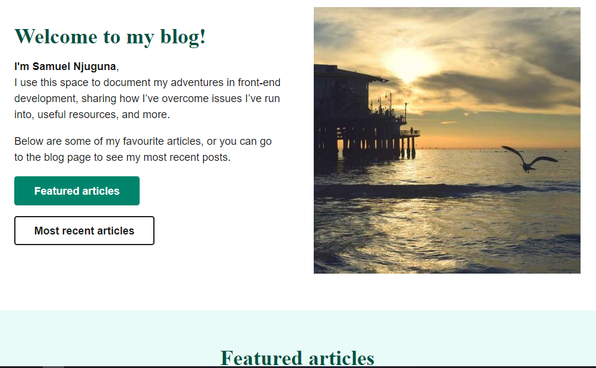

# JAMStack personal blog

This is a Personal blog created with eleventy. JAMStack applications are faster and more secure way of building. The original template files are created by [Kevin Powell](https://kevinpowell.co).

The `design-files` folder contains both a Figma file, and .jpg of a design.

The articles are written in Markdown, and include Front Matter. Eleventy is the used Static Site Generator and Nunjuncks is the Templating language.

